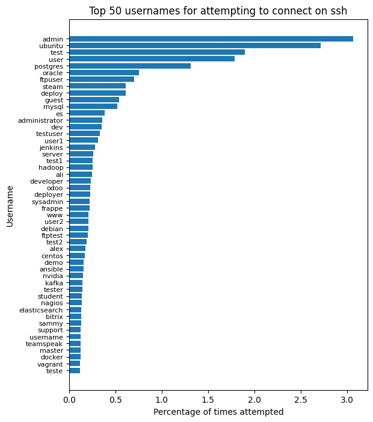

## Overview
Any server open to the internet gets a normal amount of noise of bad actors trying to connect via ssh. 
I was curious about what credientials brute force attempts were trying so I wrote some scripts to process data from my ssh logs and count the most common usernames.

## Walkthrough
If you use systemd, journalctl probably manages your logs. Start by filtering all of the lines where someone tries to connect with a user that doesn't exist on the system. This needs to be run as root. For me, the resulting file ended up being over a million lines and 22 Megabytes. This was over a year of ssh logs. 

```
journalctl -u sshd.service | grep -E "sshd.*Invalid" > sshd_invalid.txt
```

Now, extract the relevant information from the raw lines of text. I used Apache Spark through its Python API [PySpark](https://spark.apache.org/docs/latest/api/python/index.html). Spark is probably overkill for this size of task. Run [count_names.py](count_names.py) and inspect the resulting output directory and part files inside. Concatenate the part files and inspect the results.

```
spark-submit count_names.py
```

The output is in key-value pairs (represented as python tuples in the code). The key is a username that someone tried to connect with. The value also a tuple with the first number being the number of attempts tried on that username. The second is a list of ip and port pairs that tried that username.

```
('sshadmin', (13, [('141.98.10.96', 34036), ...]))
('cvs', ....)
('cumulus', ...)
('jasmin', ...)
('jesus', ...)
('bayu', ...)
('php', ...)
```

The example above is part of my output with some ip addresses not shown. You can see that 13 attempts tried to login with username `sshadmin`. The ip address [141.98.10.96](https://www.google.com/search?q=UAB+Host+Baltic&oq=UAB+Host+Baltic&gs_lcrp=EgZjaHJvbWUyBggAEEUYOTIICAEQRRgnGDsyDQgCEC4YrwEYxwEYgAQyBggDEEUYPTIGCAQQRRg8MgYIBRBFGDzSAQczNDJqMGo3qAIAsAIA&sourceid=chrome&ie=UTF-8#lrd=0x46e7183df64f09f7:0x9c60ea60ba4640ca,1,,,,)
tried to connect with preauth port 34036.

The PySpark script also generates usernames_count.csv containing a simplier csv of just usernames and number of occurances without the ip and port pairs. My ssh logs were not that large, but if for some reason yours are, you will want to not generate this file in the same manner I did. See the last comment in [count_names.py](count_names.py).

The other script, [graph_results.py](graph_results.py) takes this csv and uses Pandas to graph the most common usernames. Below is what I generated.

## Results

Most of these usernames make sense. 
When I was running this in March 2024, "palworld" was in the top 50. It is the name of a game that just came out. Hackers must think that people are hosting palworld servers.


## Other
Some notes on this process:
1. Root is by far the most common login attempt and should be number 1. It isn't counted as an "Invalid user" in the sshd logs, so I didn't count it. I'll get a better count for root in my logs later.
2. For the same reason as above, other usernames that are valid users on my system are not listed in this count.
3. Spark is way overkill for this job.

versions:  
python 3.11.8  
pyspark 3.5.1  
pandas  2.2.1  
